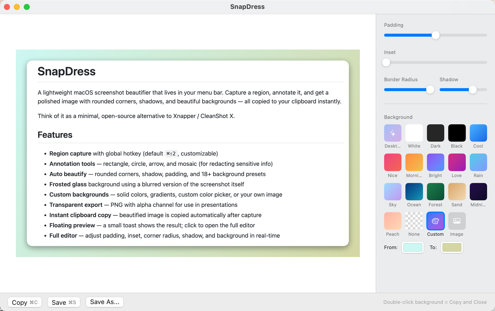
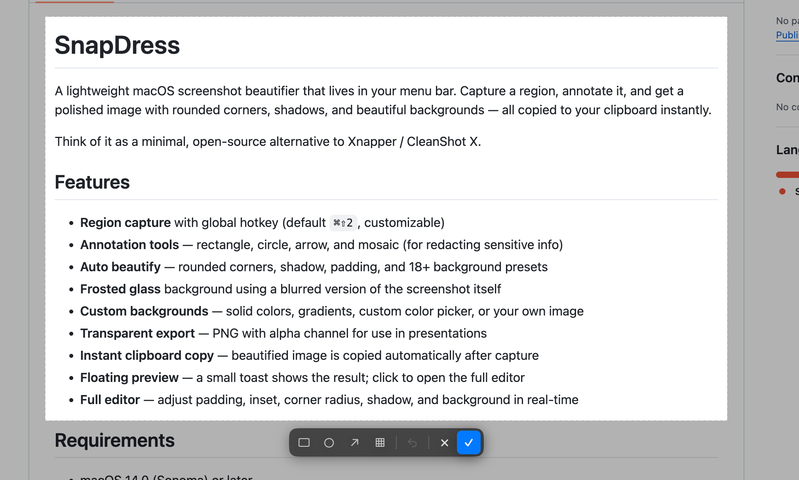

# SnapDress

A lightweight macOS screenshot beautifier that lives in your menu bar. Capture a region, annotate it, and get a polished image with rounded corners, shadows, and beautiful backgrounds — all copied to your clipboard instantly.

Think of it as a minimal, open-source alternative to Xnapper / CleanShot X.

## Screenshots

| Editor | Annotation Toolbar |
|--------|-------------------|
|  |  |

## Features

- **Region capture** with global hotkey (default `⌘⇧2`, customizable)
- **Annotation tools** — rectangle, circle, arrow, and mosaic (for redacting sensitive info)
- **Auto beautify** — rounded corners, shadow, padding, and 18+ background presets
- **Frosted glass** background using a blurred version of the screenshot itself
- **Custom backgrounds** — solid colors, gradients, custom color picker, or your own image
- **Transparent export** — PNG with alpha channel for use in presentations
- **Instant clipboard copy** — beautified image is copied automatically after capture
- **Floating preview** — a small toast shows the result; click to open the full editor
- **Full editor** — adjust padding, inset, corner radius, shadow, and background in real-time

## Requirements

- macOS 14.0 (Sonoma) or later
- Screen Recording permission

## Install

### From DMG (recommended)

Download the latest `.dmg` from [Releases](../../releases), open it, and drag SnapDress to Applications.

### Build from source

```bash
git clone https://github.com/xiangyizengdev/SnapDress.git
cd SnapDress
bash scripts/bundle.sh
open /Applications/SnapDress.app
```

## Usage

1. Press `⌘⇧2` (or your custom shortcut) to start region selection
2. Drag to select an area — a toolbar appears with annotation tools
3. Optionally annotate (circle, rectangle, arrow, mosaic), then click ✓ to confirm
4. The beautified screenshot is copied to your clipboard and a preview toast appears
5. Click the toast to open the full editor for fine-tuning

Press `ESC` at any time to cancel.

## Tech Stack

- Swift + SwiftUI + Swift Package Manager
- ScreenCaptureKit for capture
- CoreGraphics + CoreImage for image processing
- [KeyboardShortcuts](https://github.com/sindresorhus/KeyboardShortcuts) for global hotkey

## License

MIT
