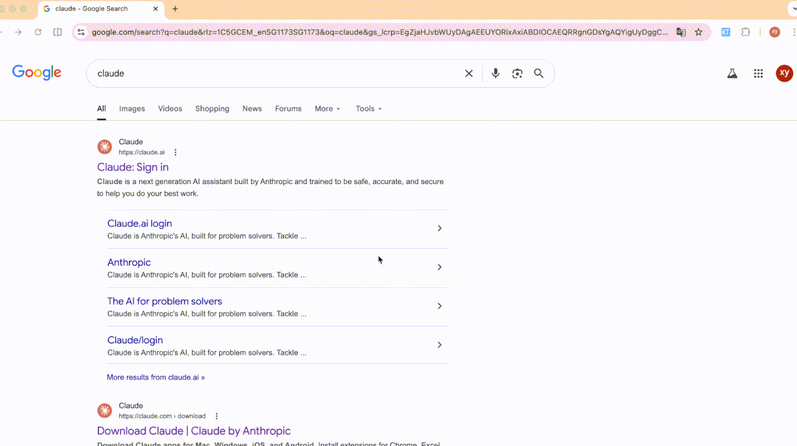

<div align="center">


# SnapDress

**A lightweight macOS screenshot beautifier — one shortcut, zero friction.**

[](https://github.com/xiangyizengdev/SnapDress/releases/latest)
[](./LICENSE)

[](https://github.com/xiangyizengdev/SnapDress/releases)

[**Download**](https://github.com/xiangyizengdev/SnapDress/releases/latest) · [Features](#features) · [Install](#install) · [Build from source](#build-from-source) · [简体中文](./README_zh.md)

</div>

> Think of it as **Xnapper × WeChat Screenshot**, for people who live in `⌘⇧2`.
>
> Capture a region, annotate it, get a polished image with rounded corners, shadows, and a beautiful background — copied to your clipboard instantly.

<div align="center">
  
</div>

## Why SnapDress

Most screenshot tools stop at "the shot". SnapDress polishes it in a single keystroke:

- **WeChat-style selection** — freeze-on-capture + pixel magnifier + drag-to-nudge means you pick the *exact* region you want, on the first try
- **Annotate without switching tools** — rectangle, circle, arrow, mosaic all a click away
- **Auto-beautify** — rounded corners, shadow, padding, and 18+ background presets, all tuned out of the box
- **Instant clipboard copy** — the finished image is already on your clipboard before your hands leave the keyboard
- **No dock icon, no noise** — lives in the menu bar, shows up only when you call it

## Features

### Capture

- Global hotkey (default `⌘⇧2`, customizable)
- **Freeze-on-capture** — the screen freezes the moment you start selecting, so moving windows don't throw you off (toggle in Preferences)
- **Pixel magnifier** — a 5× viewfinder follows your cursor during region selection for pixel-perfect boundaries
- **Drag to nudge** — after selecting, drag the rectangle to move it; arrow keys nudge 1 px, `Shift+Arrow` nudges 10 px
- **WeChat-green selection frame** — thick accent border, 8 resize handles, live pixel dimensions

### Annotate

- Rectangle, circle, arrow, and mosaic (for redacting sensitive info)
- All annotations move with the selection if you reposition

### Beautify

- Rounded corners, shadow (opacity + offset), padding, inset
- **18+ background presets** — gradients, frosted glass (blurs the screenshot itself), solid, transparent
- **Custom backgrounds** — pick any two colors, or drop in your own image
- **Retina (HiDPI) Export** (optional, off by default) — tags exports as `@2x` so they stay crisp when pasted into Figma, Sketch, or Keynote

### Flow

- Instant clipboard copy (no dialog, no save prompt)
- Floating preview toast — hover to pause, click to open the full editor
- Menu bar popover with your last 10 screenshots
- Full editor for post-capture fine-tuning

## Preview

<details>
<summary>More screenshots</summary>

**Editor**


**Annotation Toolbar**


</details>

## Install

### From DMG (recommended)

1. Download the latest [`SnapDress-1.2.0.dmg`](https://github.com/xiangyizengdev/SnapDress/releases/latest)
2. Open the DMG and drag `SnapDress` to `Applications`
3. Launch and grant Screen Recording permission in **System Settings → Privacy & Security → Screen Recording**

Requires **macOS 14.0 (Sonoma) or later**.

> The app is not notarized yet. If macOS blocks it on first launch, right-click the app → **Open** → **Open anyway**. Or run `xattr -cr /Applications/SnapDress.app`.

### Build from source

```bash
git clone https://github.com/xiangyizengdev/SnapDress.git
cd SnapDress
bash scripts/bundle.sh        # builds + installs to /Applications
# or:
bash scripts/make-dmg.sh      # produces a distributable .dmg
```

## Usage

1. Press `⌘⇧2` (or your custom shortcut) to start region selection
2. Drag to select an area — a toolbar appears with annotation tools
3. Optionally annotate, then click ✓ to confirm
4. The beautified screenshot is copied to your clipboard and a preview toast appears
5. Click the toast to open the full editor for fine-tuning

Press `ESC` at any time to cancel.

## Support this project

SnapDress is free and MIT-licensed. If it earns a spot in your daily workflow, you can support continued development:

- [**Buy Supporter Edition — $4.99**](#) — a thank-you, early access to upcoming features, and a place in the supporters list *(store coming soon)*
- [**Star this repo**](https://github.com/xiangyizengdev/SnapDress) — costs nothing, helps discovery
- [**Open an issue**](https://github.com/xiangyizengdev/SnapDress/issues) — bug reports and feature requests are welcome

Any of the above keeps the shortcuts coming.

## Roadmap

- [ ] OCR (copy text from any screenshot)
- [ ] Long screenshot / scrolling capture
- [ ] iCloud history sync
- [ ] Notarization & Mac App Store distribution
- [ ] More themes & background packs

Have a request? [Open an issue](https://github.com/xiangyizengdev/SnapDress/issues) — happy to hear what you'd like next.

## Tech Stack

- Swift + SwiftUI + Swift Package Manager
- [ScreenCaptureKit](https://developer.apple.com/documentation/screencapturekit) for capture
- CoreGraphics + CoreImage for image processing
- [KeyboardShortcuts](https://github.com/sindresorhus/KeyboardShortcuts) for global hotkeys

## Credits

Built by [@xiangyizengdev](https://github.com/xiangyizengdev). Inspired by Xnapper, CleanShot X, and WeChat's screenshot tool.

## License

[MIT](./LICENSE) — do whatever, just don't blame me.
